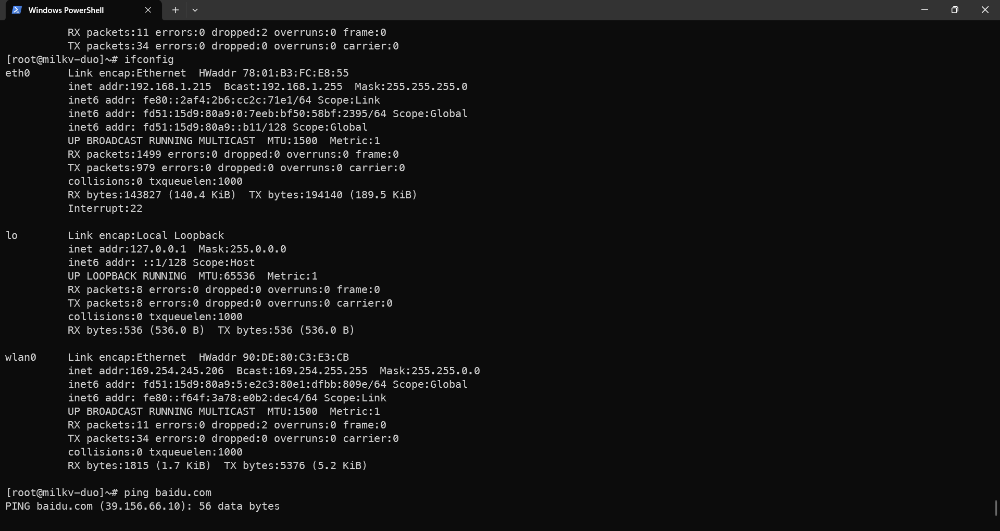

# milkv-duo 适配 RTL8723DU USB WiFi
## 清单

- [milkv-duo 开发板](https://item.taobao.com/item.htm?spm=a1z10.1-c.w4004-24811212567.2.1f7913b5Y8K002&id=707976817589)
- [RTL8723DU USB WiFi/蓝牙](https://m.tb.cn/h.57OH3eq?tk=kbe1WXhUfog)
- [官方 SDK 仓库](https://github.com/milkv-duo/duo-buildroot-sdk)

## 第一步：编译镜像

### 方法一：使用官方镜像

```sh
$ wget https://github.com/milkv-duo/duo-buildroot-sdk/releases/download/Duo-V1.0.5/milkv-duo-v1.0.5-2023-1019.img.zip
```

### 方法二：自己编译镜像

1. 克隆官方仓库

```sh
$ git clone https://github.com/milkv-duo/duo-buildroot-sdk.git
```

2. 进入  `duo-buildroot-sdk/` 执行命令

```bash
$ ./build_milkv.sh
```

3. 编译过程需要很久，可以喝杯茶歇歇。

## 第二步：编译内核模块和测试程序

克隆仓库
```shell
$ git clone https://github.com/GrootLiu/milkv-duo-rtl8723du.git
$ cd milkv-duo-rtl8723du/rtl8723du
```


## 第三步：修改交叉编译器路径

更改目录中的 `Makefile`，将 `SDK_DIR` 中的 `/path/to/duo-buildroot-sdk` 改为之前克隆的 `duo-buildroot-sdk` 的绝对路径。

## 第四步：生成驱动

```shell
$ make 
```

检查是否生成两个文件：`8723du.ko`。

## 第五步：连接 USB 设备

### 固定 MAC 地址

```sh
echo "pre-up ifconfig eth0 hw ether 78:01:B3:FC:E8:55" >> /etc/network/interfaces && sync
```

### 开启底板 USB 功能
```sh
rm /mnt/system/usb.sh
ln -s /mnt/system/usb-host.sh /mnt/system/usb.sh
sync
```

### 重启
```sh
reboot
```

### 插入 USB 设备

## 第六步：安装驱动

将前面生成的驱动拷贝到 milkv-duo 板子中。

```sh
$ insmod 8723.ko
```

## 第七步：连接 WiFi

参考下面的链接：
[Wi-Fi基本操作](https://doc.sophgo.com/cvitek-develop-docs/master/docs_latest_release/CV180x_CV181x/zh/01.software/OSDRV/Wi-Fi_User_Guide/build/html/5_Wi-Fi_Basic_Operation.html)

## 结果
